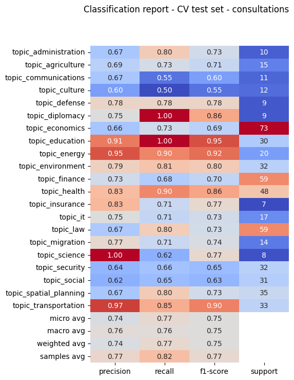
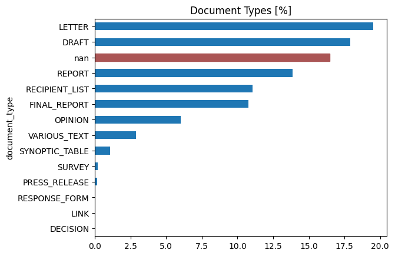

<br>
<div align="center">
    <a href="https://demokratis.ch" target="_blank">
        
    </a>
    <p>Consultation procedures for the people</p>

  <a href="https://demokratis.ch">Demokratis.ch</a> |
  <a href="https://join.slack.com/t/demokratispublic/shared_invite/zt-2r5uyt4j8-6U22Z53XkJakFkNYgpMm_A">Slack</a> |
  <a href="mailto:team@demokratis.ch">team@demokratis.ch</a>

   <a href="https://github.com/demokratis-ch/demokratis-ml/blob/main/LICENSE.md">
    
  </a>
</div>
<br>

# 🚀 What's Demokratis?

[Demokratis.ch](https://demokratis.ch) makes it easier to participate in Swiss consultation procedures in order to better influence the legislative process at the federal and cantonal level.

### About Demokratis
The consultation procedure is a fundamental, but lesser known integral part of Swiss democracy. While in theory the consultation procedure is open to everyone the barriers to participation are rather high. [Demokratis.ch](https://demokratis.ch) is an accessible and user-friendly web platform which makes it easy to explore, contribute to and monitor consultation procedures in Switzerland.

Demokratis is developed and run by a Swiss association ("Verein") with the same name and you are most welcome to join us!

### About machine learning at Demokratis
We use machine learning to process and understand the legal text drafts (Vorlagen) that are the subject of the consultation procedure, as well as to process related documents such as reports and letters accompanying the drafts.

The machine learning stack runs separately from the main [Demokratis.ch](https://demokratis.ch) website. The outputs of the models are **always reviewed by a human** before being displayed on the website.

## Table of contents

* [How to contribute](#how-to-contribute)
* [What data we use](#what-data-we-use)
* [Our models and open ML problems](#our-models-and-open-ml-problems)
    * [Current status](#current-status)
    * [Classifying consultation topics](#classifying-consultation-topics)
    * [Extracting structure from documents](#extracting-structure-from-documents)
    * [Classifying document types](#classifying-document-types)

***

## How to contribute
As a community-driven project in its early stages, we welcome your feedback and contributions! We're excited to collaborate with the civic tech, open data, and data science communities to improve consultation processes for all.

[Join us on Slack](https://join.slack.com/t/demokratispublic/shared_invite/zt-2r5uyt4j8-6U22Z53XkJakFkNYgpMm_A) in the `#ml` channel to say hello, ask questions, and discuss our data and models.

The challenges of understanding legal text with machine learning are complex. If you have experience in NLP or ML, we’d love your input! We can’t do this alone and appreciate any help or insights you can offer.

<!--
### Repository structure
TODO: explain what is where in this monorepo.
-->

## What data we use
We obtain information about federal and cantonal consultations through APIs and website scraping. For each consultation (Vernehmlassung) we typically collect a number of documents of various types:

* The proposed law change (draft, Vorlage, Entwurf, ...)
* A report explaining the proposed change (Erläuterungsbericht)
* Accompanying letters, questionnaires, synoptic tables etc...

The documents are almost always just PDFs. We also get some metadata for the consultation itself, e.g. its title, starting and ending dates, and perhaps a short description.

See the Pandera schemata in [data/schemata.py](data/schemata.py) for a complete specification of the data we have on consultations and their documents.

> [!NOTE]
> We are currently working with our data providers to make the datasets publicly accessible while following all applicable laws. [Please talk to us on Slack #ml](https://join.slack.com/t/demokratispublic/shared_invite/zt-2r5uyt4j8-6U22Z53XkJakFkNYgpMm_A) to learn more about the data and gain early access.

<!--
### The federal dataset: Fedlex
TODO - explain this data source

### The cantonal dataset: POLITmonitor
TODO - explain this data source
-->

## Our models and open ML problems

### Current status
After completing our initial research, we are now open-sourcing our work to enable feedback and contributions from the community.

For problems where solid solutions have been developed, we'll be productizing the models and displaying their outputs on the main [Demokratis.ch](https://demokratis.ch) website — always with a human reviewer involved.

We are also awaiting consent from our data providers before making the datasets publicly available.

| Problem | Public dataset? | Open-source code/model? | Initial research | Proof of concept model | Deployed in production |
|-|-|-|-|-|-|
| [Classifying consultation topics](#classifying-consultation-topics) | ❌ | ❌ | ✅ | ✅ | ❌
| [Extracting structure from documents](#extracting-structure-from-documents) | ❌ | ❌ | ✅ | ❌ | ❌
| [Classifying document types](#classifying-document-types) | ❌ | ❌ | ✅ | ✅ | ❌

### Classifying consultation topics
We need to classify each new consultation into one or more topics (such as *agriculture, energy, health, ...*) so that users can easily filter and browse consultations in their area of interest. We also support email notifications, where users can subscribe to receive new consultations on their selected topics by email.

#### Our datasets
To label our dataset, we used a combination of weak pattern-matching rules, manual labelling, and [POLITmonitor API](https://www.politmonitor.ch/en/welcome/). You can see the full list of our topics in [data/schemata.py:CONSULTATION_TOPICS](data/schemata.py#L7).

#### Our models
To increase the breadth of input for the models, we first classify individual *documents*, even though all documents of a given consultation obviously fall into the same topics. To then predict the topics of the consultation itself, we let the document outputs "vote" on the final set of topics. This approach has proven to be effective because we are giving the model more data to learn from, as opposed to classifying consultations directly – in which case we have to pick a limited number of documents, drastically concatenate them etc.

We disregard documents of type `RECIPIENT_LIST` and `SYNOPTIC_TABLE` because we have not found their signals useful. There might be more room for improvement in document selection.

We currently have **two models** with good results:

1. A "traditional" approach: we embed the documents using OpenAI's `text-embedding-3-large` model and classify those vectors directly with the simple sklearn pipeline of
    ```
    make_pipeline(
        StandardScaler(),
        MultiOutputClassifier(LogisticRegression()),
    )
    ```
2. Fine-tuning a domain-specific language model from the [🤗 joelniklaus/legallms](https://huggingface.co/collections/joelniklaus/legallms-65303ccfc2f20ed637f17cb6) collection, usually [joelniklaus/legal-swiss-roberta-large](https://huggingface.co/joelniklaus/legal-swiss-roberta-large). These pre-trained models were introduced in the paper [MultiLegalPile: A 689GB Multilingual Legal Corpus](https://arxiv.org/abs/2306.02069).

#### Current results
In general:
* The LegalLM model performs better than the "traditional" sklearn classifier. (Compute requirements are several orders of magnitude higher, though.)
* Cantonal consultations are more difficult to classify than the federal ones. Merging the two datasets helps.

Current sample-weighted F1 scores:

| Model | Cantonal consultations | Federal consultations | Cantonal+federal |
|-|-|-|-|
| `text-embedding-3-large + LogisticRegression` | 0.73 | 0.85 | 0.78 |
| `joelniklaus/legal-swiss-roberta-large` | ? | 0.92 | 0.82 |

<details>
<summary>Click here to see an example classification report</summary>

"Traditional" model, cantonal+federal consultations.


</details>

### Extracting structure from documents
An important goal of Demokratis is to make it easy for people and organisations to provide feedback (statements, Stellungnahmen) on consultations. To facilitate writing comments or suggesting edits on long complex legal documents, we need to break them apart into sections, paragraphs, lists, footnotes etc. Since all the consultation documents we can currently access are PDFs, it is surprisingly hard to extract machine-readable structure from them!

We are still researching the possible solutions to this problem. For shorter documents, the most workable solution seems to be to prompt GPT-4o to analyse a whole uploaded PDF file and emit the extracted structure in JSON. It may be possible to make this work for longer documents too with careful chunking. In initial tests, GPT-4o performed better at this task than Gemini 1.5 Pro.

The services typically used for extracting PDFs – AWS Textract, Azure Document AI, Adobe Document Services – all do not seem to be reliable at detecting PDF layouts. In particular, they do not consistently differentiate between headers, paragraphs, lists, or even footnotes. The open-source project [surya](https://github.com/VikParuchuri/surya) performs similarly as these cloud services and can easily be run locally. Another option we have not tried yet is using a LayoutLM model.


### Classifying document types
Each consultation consists of several documents: usually around 5, but sometimes as much as 20 or more. For each document, we're interested in what role it plays in the consultation: is it the actual draft of the proposed change? Is it an accompanying letter or report? (You can see the full list of document types in [data/schemata.py:DOCUMENT_TYPES](data/schemata.py#L32).)



For federal consultations, we automatically get this label from the Fedlex API. However, cantonal documents do not have roles (types) assigned, so we need to train a model.

#### Our datasets
We labelled a part of the cantonal dataset manually and through weak rules on file names (e.g. label files called 'Adressatenliste.pdf' as `RECIPIENT_LIST`). We also used the entire federal dataset because it comes already labelled.

#### Our model
We embed the documents using OpenAI's `text-embedding-3-large` model and classify those vectors directly with the simple sklearn pipeline of `make_pipeline(StandardScaler(), LogisticRegression())`.

#### Current results
When we simplify the task by labelling unknown document types as `VARIOUS_TEXT` in the training set, we currently get weighted **precision, recall, and F1 around 0.87**.

<details>
<summary>Click here to see detailed classification report</summary>

| Class           | Precision | Recall | F1-Score | Support |
|-----------------|-----------|--------|----------|---------|
| DRAFT           | 0.86      | 0.82   | 0.84     | 360     |
| FINAL_REPORT    | 0.96      | 0.94   | 0.95     | 160     |
| LETTER          | 0.97      | 0.97   | 0.97     | 324     |
| OPINION         | 0.96      | 0.99   | 0.98     | 83      |
| RECIPIENT_LIST  | 0.97      | 0.97   | 0.97     | 207     |
| REPORT          | 0.86      | 0.86   | 0.86     | 296     |
| RESPONSE_FORM   | 0.00      | 0.00   | 0.00     | 3       |
| SURVEY          | 0.74      | 0.83   | 0.78     | 24      |
| SYNOPTIC_TABLE  | 0.75      | 0.68   | 0.71     | 66      |
| VARIOUS_TEXT    | 0.72      | 0.75   | 0.74     | 375     |
| **Accuracy**    |           |        | 0.87     | 1898    |
| **Macro Avg**   | 0.78      | 0.78   | 0.78     | 1898    |
| **Weighted Avg**| 0.87      | 0.87   | 0.87     | 1898    |
</details>
