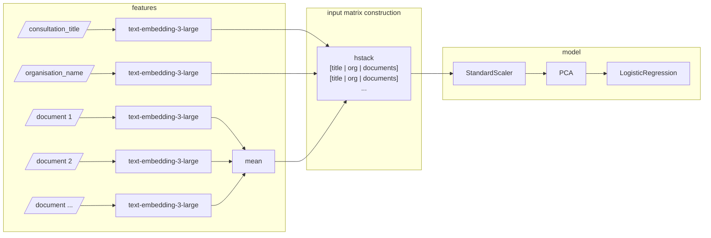

 

  
  
Consultation procedures for the people

  <a href="https://demokratis.ch">Demokratis.ch</a> |
  <a href="https://join.slack.com/t/demokratispublic/shared_invite/zt-2r5uyt4j8-6U22Z53XkJakFkNYgpMm_A">Slack</a> |
  <a href="mailto:team@demokratis.ch">team@demokratis.ch</a> |
  <a href="https://huggingface.co/demokratis">🤗 demokratis</a>

  
  
  

 

# 🚀 What's Demokratis?

[Demokratis.ch](https://demokratis.ch) makes it easier to participate in Swiss consultation procedures in order to better influence the legislative process at the federal and cantonal level.

### About Demokratis
The consultation procedure is a fundamental, but lesser known integral part of Swiss democracy. While in theory the consultation procedure is open to everyone the barriers to participation are rather high. [Demokratis.ch](https://demokratis.ch) is an accessible and user-friendly web platform which makes it easy to explore, contribute to and monitor consultation procedures in Switzerland.

Demokratis is developed and run as a civil society initiative and you are most welcome to join us!

### About machine learning at Demokratis
We use machine learning to process and understand the legal text drafts (Vorlagen) that are the subject of the consultation procedure, as well as to process related documents such as reports and letters accompanying the drafts.

The machine learning stack runs separately from the main [Demokratis.ch](https://demokratis.ch) website. The outputs of the models are **always reviewed by a human** before being displayed on the website.

## Table of contents

* [How to contribute](#how-to-contribute)
* [What data we use](#what-data-we-use)
* [Our models and open ML problems](#our-models-and-open-ml-problems)
    * [Current status](#current-status)
    * [I. Classifying consultation topics](#i-classifying-consultation-topics)
    * [II. Extracting structure from documents](#ii-extracting-structure-from-documents)
    * [III. Classifying document types](#iii-classifying-document-types)

***

## How to contribute
As a community-driven project in its early stages, we welcome your feedback and contributions! We're excited to collaborate with the civic tech, open data, and data science communities to improve consultation processes for all.

[Join us on Slack](https://join.slack.com/t/demokratispublic/shared_invite/zt-2r5uyt4j8-6U22Z53XkJakFkNYgpMm_A) in the `#ml` channel to say hello, ask questions, and discuss our data and models.

The challenges of understanding legal text with machine learning are complex. If you have experience in NLP or ML, we’d love your input! We can’t do this alone and appreciate any help or insights you can offer.

### Tooling and code quality
* We use [uv](https://docs.astral.sh/uv/) to manage dependencies. After cloning the repository, run `uv sync --dev` to install all dependencies.
* To ensure code quality and enforce a common standard, we use [ruff](https://docs.astral.sh/ruff/) and [pre-commit](https://pre-commit.com/) to format code and eliminate common issues. To make sure pre-commit runs all checks automatically when you commit, install the git hooks with `uv run pre-commit install`.
* We've started out with a fairly strict ruff configuration. We expect to loosen up some rules when they become too bothersome. A research project cannot be tied up with the same rules as a big production app. Still, it's a lot easier to start with strict rules and gradually soften them than going the other way around.
* **All code must be auto-formatted** by ruff before being accepted into the repository. pre-commit hooks (or your code editor) will do that for you. To invoke the formatter manually, run `uv run ruff format your_file.py`. It works on Jupyter notebooks, too.

<!--
### Repository structure
TODO: explain what is where in this monorepo.
-->

## What data we use
We obtain information about federal and cantonal consultations through APIs and website scraping. For each consultation (Vernehmlassung) we typically collect a number of documents of various types:

* The proposed law change (draft, "Vorlage", "Entwurf", ...)
* A report explaining the proposed change ("Erläuternder Bericht")
* Accompanying letters, questionnaires, synoptic tables etc...

The documents are almost always just PDFs. We also get some metadata for the consultation itself, e.g. its title, starting and ending dates, and perhaps a short description.

See the Pandera schemata in [demokratis_ml/data/schemata.py](demokratis_ml/data/schemata.py) for a complete specification of the data we have on consultations and their documents.

### Data acquisition and preprocessing
We use data from two main sources:

* [Fedlex](https://www.fedlex.admin.ch/) for federal ("Bund") consultations.
* [Open Parl Data](https://opendata.ch/projects/openparldata/) for cantonal consultations.

Document and consultation data is ingested from these sources into the Demokratis web platform running at [Demokratis.ch](https://demokratis.ch).
The web platform is our main source of truth. In addition to making the data available to end users, it also runs an admin interface
that we use for manual review and correction of our database of consultations and their documents.

To transform the web platform data into a dataset for training models, we run a Prefect pipeline:
[demokratis_ml/pipelines/preprocess_consultation_documents.py](demokratis_ml/pipelines/preprocess_consultation_documents.py).
The result of this pipeline is a Parquet file conforming to the above-mentioned dataframe schema.

### Our data is public
Our preprocessed dataset is automatically published to HuggingFace and you can download it directly from
[🤗 demokratis/consultation-documents](https://huggingface.co/datasets/demokratis/consultation-documents).
Don't hesitate to [talk to us on Slack #ml](https://join.slack.com/t/demokratispublic/shared_invite/zt-2r5uyt4j8-6U22Z53XkJakFkNYgpMm_A) if you have any questions about the data!

<!--
### The federal dataset: Fedlex
TODO - explain this data source

### The cantonal dataset: Open Parl Data
TODO - explain this data source
-->

## Our models and open ML problems

### Current status

| Problem | Public dataset? | Initial research | Proof of concept model | Deployed in production | Languages supported | Notes |
|-|-|-|-|-|-|-|
| [I. Classifying consultation topics](#i-classifying-consultation-topics)           | ✅    | ✅ | ✅ | ✅ | de | Only 9 out of 26 topics supported.
| [II. Extracting structure from documents](#ii-extracting-structure-from-documents) | ✅(*) | ✅ | ❌ | ❌ |
| [III. Classifying document types](#iii-classifying-document-types)                 | ✅    | ✅ | ✅ | ✅ | de | 10 out of 13 types supported; not enough samples to train for the remaining 3. Documents from cantons BL, GE, NE, SZ, VD, VS are not supported due to data quality issues.

_*) We haven't published our copies of the source PDFs, but our [public dataset](#our-data-is-public) does include links to the original files hosted by cantons and the federal government._

### I. Classifying consultation topics

We need to classify each new consultation into one or more topics (such as *agriculture, energy, health, ...*) so that users can easily filter and browse consultations in their area of interest. We also support email notifications, where users can subscribe to receive new consultations on their selected topics by email.

#### Our dataset
Our dataset – consultations & topics in an M:N relationship – is labelled manually. We also experimented with weak pattern-matching rules and topics coming from [Open Parl Data](https://opendata.ch/projects/openparldata/), but these label sources proved too inconsistent with our own labelling guidelines.
You can see the full list of our topics in [demokratis_ml/data/schemata.py:CONSULTATION_TOPICS](./demokratis_ml/data/schemata.py).

#### Our model
For each consultation, we create a vector by concatenating the embedding of the consultation title, the embedding of the publishing organisation name, and the average of the embeddings of several documents pertaining to the consultation. We select these documents by type (see [Problem III](#iii-classifying-document-types)). We would ideally include an embedding of the consultation's description as well, but we're currently missing descriptions for a large number of consultations.

We found that OpenAI embeddings work better than [jina-embeddings-v2-base-de](https://huggingface.co/jinaai/jina-embeddings-v2-base-de), which in turn works better than general-purpose sentence transformer models.

The model itself is a simple linear pipeline because our small training set size (less than 2,000 labelled consultations) is not supportive of more complex models.

#### Potential for improvement
We experimented with fine-tuning a domain-specific language model from the [🤗 joelniklaus/legallms](https://huggingface.co/collections/joelniklaus/legallms-65303ccfc2f20ed637f17cb6) collection, training it directly for multi-label classification. These pre-trained models were introduced in the paper [MultiLegalPile: A 689GB Multilingual Legal Corpus](https://arxiv.org/abs/2306.02069). This approach showed some promise and we would like to try it again: see [#22](https://github.com/Demokratis-ch/demokratis-ml/issues/22).

#### Current results
To get a model usable in production, we've restricted it to just 9 topics for which it performs well. We expect to increase topic coverage as we label more training data.

| Label             | Precision | Recall | F1-Score | Support |
|------------------|-----------|--------|----------|---------|
| agriculture       | 1.00      | 0.82   | 0.90     | 11      |
| education         | 1.00      | 0.91   | 0.95     | 11      |
| energy            | 1.00      | 0.92   | 0.96     | 12      |
| health            | 0.79      | 0.90   | 0.84     | 21      |
| insurance         | 0.83      | 0.83   | 0.83     | 12      |
| migration         | 1.00      | 0.70   | 0.82     | 10      |
| political_system  | 1.00      | 0.60   | 0.75     | 5       |
| sports            | 1.00      | 1.00   | 1.00     | 4       |
| transportation    | 1.00      | 0.85   | 0.92     | 13      |
| &nbsp; | &nbsp; | &nbsp; | &nbsp; | &nbsp; |
| Micro Avg         | 0.92      | 0.85   | 0.88     | 99      |
| Macro Avg         | 0.96      | 0.84   | 0.89     | 99      |
| Weighted Avg      | 0.94      | 0.85   | 0.88     | 99      |
| Samples Avg       | 0.94      | 0.86   | 0.86     | 99      |

#### Code
- Model code: [demokratis_ml/models/consultation_topics/](./demokratis_ml/models/consultation_topics/)
- Research & training: [research/consultation_topics/VM_consultation_topic_classifier.ipynb](./research/consultation_topics/VM_consultation_topic_classifier.ipynb)
- Production deployment: [demokratis_ml/pipelines/predict_consultation_topics.py](./demokratis_ml/pipelines/predict_consultation_topics.py)

### II. Extracting structure from documents

>[!NOTE]
>Latest work on this problem: [PR!4](https://github.com/Demokratis-ch/demokratis-ml/pull/4) is trying to use LlamaParse to convert PDFs to Markdown.

An important goal of Demokratis is to make it easy for people and organisations to provide feedback (statements, Stellungnahmen) on consultations. To facilitate writing comments or suggesting edits on long complex legal documents, we need to break them apart into sections, paragraphs, lists, footnotes etc. Since all the consultation documents we can currently access are PDFs, it is surprisingly hard to extract machine-readable structure from them!

We are still researching the possible solutions to this problem. For shorter documents, the most workable solution seems to be to prompt GPT-4o to analyse a whole uploaded PDF file and emit the extracted structure in JSON. It may be possible to make this work for longer documents too with careful chunking. In initial tests, GPT-4o performed better at this task than Gemini 1.5 Pro. [See our starting prompt for GPT-4o here](./research/structure-extraction/README.md) along with sample input and output.

The services typically used for extracting PDFs – AWS Textract, Azure Document AI, Adobe Document Services – all do not seem to be reliable at detecting PDF layouts. In particular, they do not consistently differentiate between headers, paragraphs, lists, or even footnotes. The open-source project [surya](https://github.com/VikParuchuri/surya) performs similarly as these cloud services and can easily be run locally. Another option we have not tried yet is using a LayoutLM model.

### III. Classifying document types

Each consultation consists of several documents: usually around 5, but sometimes as much as 20 or more. For each document, we're interested in what role it plays in the consultation: is it the actual draft of the proposed change? Is it an accompanying letter or report? (You can see the full list of document types in [demokratis_ml/data/schemata.py:DOCUMENT_TYPES](demokratis_ml/data/schemata.py).)

For federal consultations, we automatically get this label from the Fedlex API. However, cantonal documents do not have roles (types) assigned, so we need to train a model.

<!--
ax = (df.value_counts("document_type", dropna=False, normalize=True, ascending=True) * 100).plot.barh(
    title="Document Types [%]"
)
bars = ax.patches
for bar, label in zip(bars, df.value_counts("document_type", dropna=False, normalize=True, ascending=True).index):
    if pd.isna(label):
        bar.set_color("#a55")
 -->

#### Our datasets
We labelled a part of the cantonal dataset manually and through weak rules on file names (e.g. label files called 'Adressatenliste.pdf' as `RECIPIENT_LIST`). We also used the entire federal dataset for training because it comes already labelled.

We merge some of the most underrepresented document types into VARIOUS_TEXT (the "everything else" class) before training and evaluation.

Documents from cantons BL, GE, NE, SZ, VD, VS are not used for training and evaluation because we are experiencing many data quality issues, and subsequently bad model performance, for these cantons.

We're only working with German-language documents in training, evaluation, and inference. This is a temporary limitation that we'd like to remove: see issue !26.

#### Our model
Our classifier uses three types of features:
- Document texts embedded with OpenAI's `text-embedding-3-large` model, with dimensions reduced by PCA
- Simple boolean flags extracted by regular expressions on document texts, e.g. "does the text contain a formal greeting like `Sehr\s+geehrte[r]?\s+(?:Frau|Herr|Damen\s+und\s+Herren)`?")
- Some features extracted from the actual PDF documents, e.g. aspect ratio, number of tables, page count,...

We then classify these input vectors with a simple scikit-learn pipeline using `StandardScaler` and `SVC`.

#### Current results
Only manually labelled cantonal documents are used for this evaluation to ensure that we're benchmarking against the most relevant data.
In production, the model is only ever used to classify _cantonal_ documents.

| Label           | Precision | Recall | F1-Score | Support |
|----------------|-----------|--------|----------|---------|
| DRAFT          | 0.88      | 0.90   | 0.89     | 58      |
| FINAL_REPORT   | 0.89      | 0.53   | 0.67     | 15      |
| LETTER         | 0.99      | 1.00   | 0.99     | 79      |
| OPINION        | 0.57      | 1.00   | 0.73     | 4       |
| RECIPIENT_LIST | 1.00      | 1.00   | 1.00     | 37      |
| REPORT         | 0.81      | 0.93   | 0.86     | 95      |
| SURVEY         | 1.00      | 0.91   | 0.95     | 11      |
| SYNOPTIC_TABLE | 0.93      | 0.91   | 0.92     | 46      |
| VARIOUS_TEXT   | 0.89      | 0.72   | 0.80     | 58      |
| &nbsp; | &nbsp; | &nbsp; | &nbsp; | &nbsp; |
| Accuracy       |           |        | 0.90     | 403     |
| Macro Avg      | 0.88      | 0.88   | 0.87     | 403     |
| Weighted Avg   | 0.90      | 0.90   | 0.90     | 403     |

#### Code
- Model code: [demokratis_ml/models/document_types/](./demokratis_ml/models/document_types/)
- Research & training: [research/document_types/VM_document_type_classifier.ipynb](./research/document_types/VM_document_type_classifier.ipynb)
- Production deployment: [demokratis_ml/pipelines/predict_document_types.py](./demokratis_ml/pipelines/predict_document_types.py)
